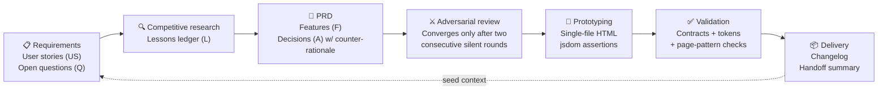

<div align="center">

# prodesign

**Design integrity should be the product of a system — not the self-discipline of a genius.**

[](https://claude.com/claude-code)
[](#the-workflow)
[](#three-tier-validation)
[](#a-design-spec-that-covers-all-six-layers)
[](./LICENSE)

A product design workflow for the AI era · A Claude Code skill suite

Requirements → Competitive Research → PRD → Adversarial Review → Prototyping → Mechanical Validation → Versioned Delivery

[中文](./README.md) · **English**

</div>

---

## Before Anything Else

**In the future there will be no product managers and no engineering managers — only product-engineering managers.**

This workflow is how that future works.

## Why This Exists

AI can write a PRD that *looks* complete in an hour. But between *looking* complete and *being* complete lies everything that explodes in review meetings and sprint planning: the missing failure paths, the ID collisions across versions, the prototype that drifted away from the spec, demo data that contradicts itself across pages, and last version's decisions quietly reversed.

prodesign's answer is not a smarter prompt. It is a **system**:

> **Every stage's output is the next stage's input contract. Whatever is missing has nowhere to hide.**

- **Everything is addressable** — modules (M), features (F), user stories (US), architecture decisions (A), open questions (Q), competitor lessons (L): all numbered, with namespaces that prevent collisions;
- **Everything is verifiable** — contracts are checked by zero-dependency scripts; visual consistency is enforced by design tokens plus validators. "Consistent style" stops being a subjective review note and becomes a regex;
- **Everything is traceable** — a delivery index, per-version changelogs, and session handoff summaries turn every decision, reversal, and hard-won lesson into seed context for the next version.

AI generates. Scripts verify. **Humans appear only at decision points.**

## The Workflow



| Command | Stage | Key output |
|---|---|---|
| `/prodesign-new` | 0 · Kickoff | Version workspace + goal brief |
| `/prodesign-req` | 1 · Requirements | User stories with testable acceptance criteria + a Q-table **decided item-by-item by the user** |
| `/prodesign-research` | 2 · Competitive research | A lessons ledger — specific down to *which product's mechanism cost what* |
| `/prodesign-prd` | 3 · PRD | Features (happy path + failure paths) · every decision carries a **counter-rationale** · a Won't table with dispositions |
| `/prodesign-review` | 4 · Adversarial review | Interrogation across failure paths / concurrency / privilege escalation / empty states / self-reference |
| `/prodesign-proto` | 5 · Prototyping | Zero-dependency single-file prototypes + ID-anchored assertions + story walkthroughs |
| `/prodesign-validate` | ✓ · Validation | Structure / IDs / contracts / tokens / page patterns — one command, full physical |
| `/prodesign-archive` | ⏹ · Delivery | Strict validation → frozen deliverables → index / registry / handoff |
| `/prodesign-auto` | ∞ · Autopilot | Drives all stages in sequence, pausing only at decision points |

## Core Mechanics

### The contract chain

Stages don't pass documents to each other — they pass **mechanically verifiable contracts**:

```
US user stories ──must be covered by──▶ F features ──must be anchored by──▶ jsdom assertions
Q open questions ──must be decided & backfilled──▶ PRD Appendix C ──lands in──▶ A decisions / F / Won't
L competitor lessons ──must be cited by──▶ the counter-rationale of every A decision
every change ──explained file-by-file──▶ changelog ──distilled into──▶ the next version's handoff
```

The least common rule of the bunch: **every architecture decision must state its counter-rationale** — why the strongest industry approach was *not* chosen, citing the real-world cost paid by a competitor (chronic community complaints, documented limitations, migration post-mortems). A decision without a counter-rationale doesn't earn a place in Appendix A.

### Versioning and the freeze principle (openspec-style)

```
changes/<v4.4-topic>/   Active version workspace (seven artifacts: brief →
                        requirements → research → prd → review →
                        prototypes+checks → changelog+handoff)
deliverables/           Frozen deliverables — updated only through archive,
                        never edited in place
registry/ids.md         The ID ledger — the single authority on uniqueness
```

The freeze rules: *shipped IDs never move — newcomers yield*; *an ID denotes identity, not chronology*; *what can stay untouched, stays untouched*. Changes to shipped modules go through a new version's "related-refactor" section, so history remains forever traceable.

### Three-tier validation

| Tier | Carrier | What it checks |
|---|---|---|
| **Generic mechanical checks** | `prodesign.mjs` (zero-dependency) | Structure · ID uniqueness & collisions · US→F coverage · Q resolution · counter-rationales · external dependencies · **magic color values** |
| **Product-owned validators** | `deliverables/tools/validators/` | Menu signature · **token drift** (every page's `:root` ≡ the skeleton) · base-layout class names · **page-pattern required elements** · **contrast ratios (WCAG AA, computed)** |
| **Per-version assertions** | `checks/*.js` (jsdom) | Every assertion anchors an F/A ID: structural invariants · negative structural proofs · layout assertions |

### A design spec that covers all six layers

Layered after design-system anatomy (Foundations → Tokens → Components → Patterns → Content → A11y), with **mechanical enforcement at every layer**:

- **Design tokens**: a seed → map → alias three-tier model (after Ant Design v5). Color values may exist *only* in the `:root` token layer — visual consistency is guaranteed by a regex, not by good intentions;
- **Page skeleton**: each product instantiates `_page-skeleton.html` — layout shell + a full component style library + a living specimen section. Every new page starts as a copy of the skeleton. A single-file Storybook;
- **Page patterns**: a B2B console has exactly five page types (list / detail / form / dashboard / result). Every page declares its type via `<meta name="page-type">`, making block order and required elements checkable;
- **Content spec**: data-format tables (time / thousands separators / empty value `—` / masking), five copywriting principles (three-part error messages, one-name-per-concept), verb tables for buttons, state vocabularies;
- **Accessibility baseline**: token contrast ratios computed as pure math (4.5:1 body / 3:1 auxiliary), executed automatically by validators.

Prototypes are deliberately **zero-dependency single-file HTML** — a delivery feature, not conservatism: double-click to open, present in reviews, attach to email, and still working when unarchived three years later. A prototype is the PRD's frozen evidence, not a code baseline.

## Quick Start

```bash
# Via the skills CLI (recommended)
npx skills add liyizhecn/prodesign

# Or via the installer (copies 10 skills into <project>/.claude/skills/)
git clone --depth 1 git@github.com:liyizhecn/prodesign.git /tmp/prodesign \
  && bash /tmp/prodesign/install.sh /path/to/your/project \
  && rm -rf /tmp/prodesign

# Restart your Claude Code session, then:
/prodesign-new        # Initialize the design repository + open the first version
/prodesign-auto       # Or just engage autopilot
```

Scaffolding and validation are handled entirely by a zero-dependency Node script:

```bash
node .claude/skills/prodesign/scripts/prodesign.mjs <init|new|status|validate|archive>
```

## Where the Methodology Comes From

This workflow wasn't invented in a vacuum:

1. **Reverse-engineered** from a product manager's real practice of shipping 16 PRDs and 22 highly consistent interactive prototypes with AI — a four-role pipeline, delivery index, changelogs, session handoffs, ADRs with counter-rationales, ghost-entity audits, and ID-anchored jsdom assertions;
2. **Hardened against B2B product design theory** — the conceptual-model triad (entity relations / state machines / permission matrices), data migration for shipped versions, MoSCoW/RICE, Kano-style must-have checklists;
3. **Aligned with industry standards** — openspec's change workflow, Ant Design's design patterns and v5 token model, the W3C Design Tokens specification (DTCG 2025.10), and WCAG 2.2.
