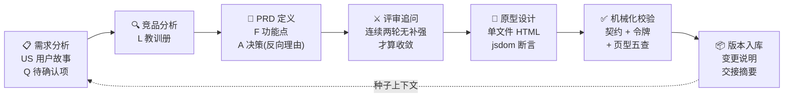

<div align="center">

# prodesign

**设计的完整性不该依赖天才的自觉，而应该是制度的产物。**

[](https://claude.com/claude-code)
[](#命令一览)
[](#三级校验体系)
[](#设计规范六层全覆盖)

面向 AI 时代的产品设计工作流 · Claude Code Skill 套件

需求分析 → 竞品分析 → PRD 定义 → 评审追问 → 原型设计 → 机械化校验 → 版本入库

</div>

---

## 写在前面

**未来没有产品经理，也没有研发经理，只有产品研发经理。**

这套工作流，就是为这个未来准备的工作方式。

## 为什么存在

AI 可以在一小时内写出一份"看起来完整"的 PRD。但**看起来完整**和**真正完整**之间，隔着所有会在评审会和开发排期里爆炸的东西：漏掉的异常流、跨版本撞号的编号、与 PRD 脱节的原型、互相矛盾的演示数据、上个版本刚拍板就被悄悄推翻的决策。

prodesign 的回答不是一条更聪明的提示词，而是一套**制度**：

> **每个阶段的输出，是下一阶段的输入契约。漏掉的东西无处可藏。**

- **一切可寻址** —— 模块 M、功能点 F、用户故事 US、架构决策 A、待确认项 Q、竞品教训 L，全量编号，命名空间防撞号；
- **一切可校验** —— 契约由零依赖脚本机械验证，样式一致性由设计令牌 + 校验器兜底，"风格统一"从主观评审项变成正则可查项；
- **一切可追溯** —— 交付索引、变更说明、会话交接摘要三件套，让每个版本的决策、反转与踩坑都成为下一个版本的种子上下文。

AI 负责生成，脚本负责验证，**人只在拍板点出现**。

## 工作流



| 命令 | 阶段 | 关键产出 |
|---|---|---|
| `/prodesign-new` | 0 · 立项 | 版本工作区 + 目标 brief |
| `/prodesign-req` | 1 · 需求分析 | 用户故事（验收标准可判定）+ Q 表 **逐条用户拍板** |
| `/prodesign-research` | 2 · 竞品分析 | 教训册 —— 具体到"哪家产品的哪个机制、付出了什么代价" |
| `/prodesign-prd` | 3 · PRD 定义 | F 功能点（主流程/异常流）· A 决策必带**反向理由** · Won't 表带处置 |
| `/prodesign-review` | 4 · 评审追问 | 对抗式追问：失败路径 / 并发时序 / 越权 / 空态 / 自指问题 |
| `/prodesign-proto` | 5 · 原型设计 | 零依赖单文件原型 + 锚定编号的断言 + US 走查 |
| `/prodesign-validate` | ✓ · 校验 | 结构 / 编号 / 契约 / 令牌 / 页型，一条命令全量体检 |
| `/prodesign-archive` | ⏹ · 入库 | strict 校验 → 交付物冻结 → 索引 / 登记簿 / 交接摘要 |
| `/prodesign-auto` | ∞ · 自动驾驶 | 顺序驱动全流程，仅在拍板点停下 |

## 核心机制

### 契约衔接链

阶段之间不是"文档传递"，是**可机械验证的契约**：

```
US 用户故事 ──必须被覆盖──▶ F 功能点 ──必须被锚定──▶ jsdom 断言
Q 待确认项 ──必须拍板回填──▶ PRD 附录 C ──落点──▶ A 决策 / F / Won't
L 竞品教训 ──必须被引用──▶ A 决策的「反向理由」
一切变更 ──逐文件说明──▶ changelog ──沉淀──▶ 下一版本的交接摘要
```

其中最不常见的一条：**每条架构决策必须写"反向理由"** —— 说明为什么不采用业界最强方案，并引用竞品的真实代价（社区高频问题、文档自认限制、迁移公告）。没有反向理由的决策，不配进附录 A。

### 版本与冻结（openspec 风格）

```
changes/<v4.4-topic>/   进行中版本工作区（七件套：brief → requirements
                        → research → prd → review → prototypes+checks
                        → changelog+handoff）
deliverables/           已冻结交付物 —— 只能经 archive 更新，永不回改
registry/ids.md         编号登记簿 —— 唯一性权威
```

冻结原则："已交付编号不动，让后来者让路"、"编号只表示身份，不表示时序"、"能不动的就不动"。对已交付模块的改动走新版本的「关联改造」小节，历史永远可追溯。

### 三级校验体系

| 层 | 载体 | 检查什么 |
|---|---|---|
| **通用机械校验** | `prodesign.mjs`（零依赖） | 结构完整 · 编号唯一/撞号 · US→F 覆盖 · Q 定论 · 反向理由 · 外部依赖 · **魔法色值** |
| **产品自有校验器** | `deliverables/tools/validators/` | 菜单签名 · **token 漂移**（每页 `:root` ≡ 骨架）· 基座类名 · **页型必备元素** · **对比度（WCAG AA 自动计算）** |
| **版本断言** | `checks/*.js`（jsdom） | 每条断言锚定 F/A 编号：结构性恒等式 · 反向结构验证 · 布局断言 |

### 设计规范六层全覆盖

按设计系统解剖学（Foundations → Tokens → Components → Patterns → Content → A11y）逐层落地，且**每层都有机械校验兜底**：

- **设计令牌**：seed → map → alias 三层（借鉴 Ant Design v5 模型），一切色值只允许出现在 `:root` 令牌层——"样式一致"由正则保证，不靠自觉；
- **骨架基座**：每个产品从模板实例化 `_页面骨架.html`——布局骨架 + 全组件样式库 + 样例区，新页一律"复制骨架 → 写内容"，单文件版的 Storybook；
- **页型规范**：ToB 后台只有五种页面（列表 / 详情 / 表单 / 仪表盘 / 结果），每页 `<meta name="page-type">` 声明页型，标准区块顺序 + 必备元素可校验；
- **内容规范**：数据格式表（时间 / 千分位 / 空值 `—` / 脱敏）、文案五原则（错误三要素、一物一名）、按钮动词表、状态词表；
- **无障碍基线**：token 对比度纯数学计算（正文 4.5:1 / 辅助 3:1），校验器自动执行。

原型坚持**零依赖单文件 HTML**——这是刻意的交付特性：双击即开、评审投屏、邮件分发、归档三年后依然能打开。原型是 PRD 的冻结附件证据，不是代码基线。

## 快速开始

```bash
# 安装到项目（复制 10 个 skill 到 <project>/.claude/skills/）
git clone --depth 1 git@github.com:liyizhecn/prodesign.git /tmp/prodesign \
  && bash /tmp/prodesign/install.sh /path/to/your/project \
  && rm -rf /tmp/prodesign

# 重启 Claude Code 会话，然后：
/prodesign-new        # 初始化产品资料库 + 开启第一个版本
/prodesign-auto       # 或者直接自动驾驶
```

脚手架与校验全部由零依赖 Node 脚本完成：

```bash
node .claude/skills/prodesign/scripts/prodesign.mjs <init|new|status|validate|archive>
```

## 方法论来源

这套工作流不是凭空设计的：

1. **逆向工程**一位产品经理用 AI 产出 16 份 PRD + 22 个高一致性交互原型的完整实践——四角色流水线、交付索引、变更说明、会话交接摘要、ADR 反向理由、幽灵实体审计、jsdom 断言锚定编号；
2. **对照 ToB 产品设计理论**补强——概念模型三大件（实体关系 / 状态机 / 权限矩阵）、存量迁移、MoSCoW/RICE、Kano 基本型需求检查单；
3. **对齐业界标准**——openspec 的变更工作流、Ant Design 设计模式与 v5 令牌模型、W3C 设计令牌规范（DTCG 2025.10）、WCAG 2.2。
